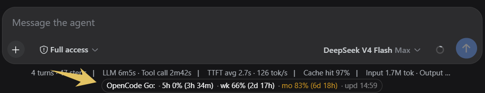
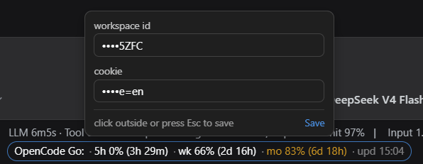
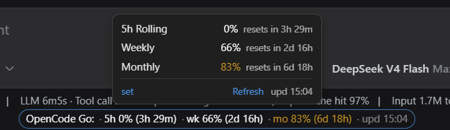

# dsh-opencode-go-usage

[English](README.en.md) | 中文

[](https://www.npmjs.com/package/dsh-opencode-go-usage)
[](./LICENSE)



一个 [DeepSeek Harness](https://github.com/deepseek-ai/deepseek-harness) (dsh) **bundle**，在 Web 界面的输入框上方 dock（与内置 token 统计同位置）显示 [OpenCode Go](https://opencode.ai/docs/go/) 订阅用量。

它是 [pi-ocgo-usage](https://github.com/v587d/pi-ocgo-usage)（Pi 插件）的 Web 对应物：三个用量窗口（5h 滚动 / 每周 / 每月）的百分比与重置倒计时，按阈值变色，让你在窗口耗尽、请求被限流之前就发现。

```
OpenCode Go: 5h 0% (1h 23m) · wk 65% (2d 20h) · mo 83% (6d 21h) · upd 20:15
```

## 特性

- **三个窗口** —— 5h 滚动 / 每周 / 每月 的百分比 + 重置倒计时
- **颜色阈值** —— 正常 → 黄色警告（≥80%）→ 红色错误（≥90% 或已限流）
- **数据新鲜度** —— `upd HH:MM` 显示最近一次成功抓取时间
- **轻量轮询** —— 每 10s 轮询（切回标签页立即刷新）；host 端 300s 缓存（TTL 可配）+ 60s 失败冷却，不会频繁打扰 opencode.ai
- **Provider 感知** —— 仅当会话当前模型走 `opencode-go` provider 时显示；每次轮询读取内存中的实时模型选择（`session.models`，毫秒级），切到 DeepSeek 官方等其它 provider 后一个轮询周期内自动隐藏，切回自动恢复（与 pi-ocgo-usage 行为一致）
- **点击展开** —— 详情面板显示每个窗口的重置倒计时，左下角 `set` 可配置凭据，右侧 `refresh upd HH:MM` 手动刷新
- **内置凭据编辑器** —— 无需碰终端：`set` 面板直接修改 workspace id 与 cookie（输入框以 `••••` + 末尾 4 位显示，点击外部 / Esc / 保存确认写入）
- **优雅降级** —— 配置缺失显示 `<err:noconfig>`，HTTP 失败显示 `<err:httpXXX>`；出错时点击 chip 直接进入 set 面板
- **Cookie 只在 host 侧** —— 浏览器只访问同源 `/api/ocgo-usage` JSON 端点，cookie 永不进入页面

> **⚠️ 需要 OpenCode Go 会话 cookie。** 该 cookie 是完整用户会话（不是 API key），可访问你 OpenCode 账户的全部内容。请像对待密码一样对待它——见 [配置](#配置)。

## 环境要求

- DeepSeek Harness `0.1.0-rc.6` 或更新（web profile）
- `PATH` 上有 pnpm（`dsh plugin` 需要）

## 安装

这是一个标准的 dsh **bundle**：`package.json` 声明了 `dsh.bundle`，通过 `dsh plugin --profile web add <spec>` 安装（pnpm 转发器），自动加入 profile 的 `dsh.profile.bundles`。仓库内置预构建的 `lib/` 产物，**安装无需任何构建步骤或构建权限**——遵循官方 [publish 指南](https://github.com/deepseek-ai/deepseek-harness/blob/master/docs/user/develop/basic/publish.md)。

### 从 GitHub 安装（推荐）

```sh
dsh plugin --profile web add github:v587d/dsh-opencode-go-usage
```

因为 `lib/` 已提交到仓库，pnpm 直接安装构建好的包，不会要求构建脚本授权。

### 从 npm 安装（发布后）

```sh
dsh plugin --profile web add dsh-opencode-go-usage
```

### 从 tarball 安装

```sh
pnpm pack            # 在本仓库内 → dsh-opencode-go-usage-0.1.0.tgz
dsh plugin --profile web add ./dsh-opencode-go-usage-0.1.0.tgz
```

### 本地开发安装

```sh
git clone https://github.com/v587d/dsh-opencode-go-usage.git
cd dsh-opencode-go-usage
pnpm install
pnpm run build
dsh plugin --profile web add link:$(pwd)
```

**重启 `dsh web` 并刷新页面**，chip 出现在输入框上方的 dock。不启动即可验证插件层已组合：

```sh
dsh --profile web --dump-config   # 应显示 "# == dsh-opencode-go-usage" 层
```

## 配置

### 方式一：界面内 set 面板（最简单）

点击 chip 展开详情 → 左下角 `set` → 输入 workspace id 与 cookie（已设置的值以 `••••` + 末尾 4 位显示，聚焦即可输入新值）→ 点击外部 / Esc / 保存按钮确认，立即生效。



### 方式二：环境变量（与 pi-ocgo-usage 同名）

```sh
export OPENCODE_GO_COOKIE="auth=Fe26.2*...; oc_locale=zh"
export OPENCODE_GO_WORKSPACE_ID="wrk_01XXXXXXXXXXXXXXXXXXXXXXXX"
```

### 方式三：配置文件

写入 `$DSH_HOME/ocgo-usage.json`（默认 `~/.dsh/ocgo-usage.json`）：

```jsonc
{
  "cookie": "auth=Fe26.2*...; oc_locale=zh",
  "workspaceID": "wrk_01XXXXXXXXXXXXXXXXXXXXXXXX"
}
```

```sh
chmod 600 ~/.dsh/ocgo-usage.json
```

优先级：环境变量 > 配置文件 > 内置默认。

### 可选覆盖项

| 环境变量 | 默认值 | 说明 |
|---|---|---|
| `OPENCODE_GO_BASE_URL` | `https://opencode.ai` | API 基础地址 |
| `OPENCODE_GO_CACHE_TTL` | `300` | host 缓存秒数，范围 60–3600 |
| `OPENCODE_GO_TIMEOUT_MS` | `10000` | HTTP 超时 |

组合层配置（`~/.dsh/profiles/web/cordis.patch.yml`）：

```yaml
- id: ocgo-usage
  config:
    enabled: false    # 总开关，默认 true
```

> **Cookie 过期：** `auth` cookie 签发后有效期 1 年。过期（或被吊销）后页面 302 跳转到登录页，chip 显示 `<err:http302>` 而非过期数字。重新登录 opencode.ai 后，通过 set 面板更新 cookie 即可。

## 使用

点击 chip 展开详情面板：每个窗口显示完整名称、百分比与重置倒计时；右下角 `refresh upd HH:MM` 手动刷新并显示数据时间。



## 工作原理

- **Host 半**（`src/index.ts`、`src/service.ts`、`src/api.ts`、`src/routes.ts`）—— 携带 cookie 抓取 `GET /workspace/<wrk>/go`，解析 SSR 渲染的 `data-slot="usage-item"` 块为每个窗口的 `{percent, resetInSec, status}`，缓存结果，通过同源 JSON 端点 `/api/ocgo-usage`（+ `/api/ocgo-usage/refresh`、`/api/ocgo-usage/config`）提供数据。
- **浏览器半**（`src/client/`）—— 向 `conversation.composer.dock` slot 注册 chip，每 10s 轮询 host 端点，按严重级别着色渲染三个窗口；可见性来自 `session.models` 的实时 provider 判断。

浏览器永远看不到 cookie；抓取与解析全部在 host 侧完成。

## 安全

- `auth` cookie 是**完整的 OpenCode 用户会话**。任何人拿到它都能访问你账户内的所有 workspace、订阅与账单信息。
- 插件**绝不**记录 cookie、不把它放进错误信息、不发送给浏览器。
- 配置编辑器只把新值写入 `$DSH_HOME/ocgo-usage.json`（chmod 600），浏览器始终只看到 `••••` + 末尾 4 位的掩码视图。

## 开发

```sh
pnpm install
pnpm run build     # tsc -b && tsdown → lib/
pnpm run typecheck # tsc -b --pretty false
pnpm test          # vitest run（解析器 / 配置 / 服务）
```

构建配置（`shared/tsdown.client.ts`）改编自 [dsh-balance-meter](https://github.com/Ghost011118/dsh-balance-meter)（BSD-3-Clause），后者是官方 DSH `packages/client/tsdown.client.ts` 的副本——它产出 web shell 模块表所需的 `window.__ModuleLoader__.load({id, factory})` 闭包工厂产物。

## License

MIT —— 见 [LICENSE](./LICENSE)。
